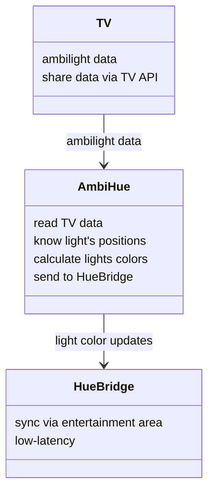

# AmbiHue

[](https://github.com/maarnix/ambihue/actions/workflows/superlinter.yml)
[](https://github.com/maarnix/ambihue/actions/workflows/docker_build.yml)

Program restores connection between Philips Ambilight TVs and the Hue Bridge by reading Ambilight data from the TV and forwarding it to Hue via the Entertainment Area API.

The Hue Entertainment Area provides low-latency color updates, offering significantly faster response times compared to standard light control via the Hue API.

**It is possilbe to get 15 updates per second!**




## Setup user configuration

1. Copy config:

   ```bash
   cp userconfig.example.yaml userconfig.yaml
   ```

1. Install `ambihue` repository

   Activate virtual env

   ```bash
   pip3 install -r requirements.txt
   pip3 install .
   ```

### Setup Ambilight TV

1. Setup IP, protocol, prot and API version.
2. In case of problem use [`pylips` config discover feature](https://github.com/eslavnov/pylips/tree/master?tab=readme-ov-file#new-users)
3. If needed for Android TVs, add user and password to the userconfig.yaml file
   ```yaml
   ambilight_tv:
     protocol: "https://" # "http://" or "https://"
     ip: "[TV IP ADDRESS]" # IP address of the TV
     port: 1926 # 1925 for APIv5, 1926->APIv6? or 1925->HTTP, 1926->HTTPS?
     api_version: 6 # API version of the TV: 1, 5 or 6
     path: "ambilight/processed" # leave default. see code in `ambilight_tv.py`
     wait_for_startup_s: 29 # Timeout for pinging device before reporting an error
     power_on_time_s: 8 # Timeout to FINISH TV booting before sending commands
     user: "[USER-FROM-PYLIPS]"
     password: "[PASS-FROM-PYLIPS]"

4. Verify connection by calling ambihue.py
    ```bash
    ./ambihue.py --verify tv --loglevel DEBUG
    ```

### Setup Hue Entertainment

1. Create Entertainment area in Philips app. [See official tutorial](https://www.youtube.com/watch?v=OlXapdkedus)

1. Get your bridge access data

    ```bash
    ./ambihue.py --discover_hue --loglevel DEBUG
    ```

   More information on [`hue-entertainment-pykit` repository readme.](https://github.com/hrdasdominik/hue-entertainment-pykit?tab=readme-ov-file#discovery-optional)

1. Use printed values to fill config `hue_entertainment_group` config data
```yaml
hue_entertainment_group:
  _identification: "[...]"
  _rid: "[...]"
  _ip_address: "[YOUR BRIDGE IP]"
  _swversion: [...]
  _username: "[...]"
  _hue_app_id: "[...]"
  _client_key: "[...]"
  _name: "[...]"
  index: 0 # Your Entertainment Area selection by index - manual adjustment
```
2. Verify connection by calling ambihue
    ```bash
    ./ambihue.py --verify hue --loglevel DEBUG
    ```
   The id=0 light in your entertainment zone should be red now.

### Setup Light Position

1. Add light configuration:

    ```yaml
    lights_setup:
      A_name: "your name"
      A_id: 0 # light number in your entertainment area (not the id in your full hue setup)
      A_positions: [0, 1]# indexes of color positions used to calculate the average color
    ```
    Positions index `[1-16]` table:

    ```text
    [4] 0Top  [5]1T  [6]2T  [7]3T  [8]4T  [9]5T  [10]6T  [11]7T  [12] 8Top
    [3] 3Left  ↗    →          →        →       →       →      ↘ [13] 0Right
    [2] 2Left  ↑                                               ↓ [14] 1Right
    [1] 1Left  ↑                                               ↓ [15] 2Right
    [0] 0Left  ↑                                               ↓ [16] 3Right
    ```

    Example of config for two up and down lights on a wall. NOTE: the id's below are within the Entertainment Area and not the id's of the lights in your full Hue setup

    ```yaml
    lights_setup:
      A_name: "wall_left_down"
      A_id: 0
      A_positions: [0, 1, 3]
      B_name: "wall_left_up"
      B_id: 1
      B_positions: [2, 4, 5]
      C_name: "wall_right_up"
      C_id: 2
      C_positions: [8, 9, 11]
      D_name: "wall_right_down"
      D_id: 3
      D_positions: [10, 12, 13]
    ```
    
2. Use [this video to test colors](https://youtu.be/8u4UzzJZAUg?t=66)
3. To verify config run ambihue

    ```bash
    ./ambihue.py --loglevel DEBUG
    ```
## Home Assistance Usage

### Via UI

1. [](https://my.home-assistant.io/redirect/supervisor_add_addon_repository/?repository_url=https%3A%2F%2Fgithub.com%2Fmaarnix%2Fambihue)
1. Navigate to HA Addon and click `AmbiHue`

    

1. Install addon and navigate to `Configuration` card

1. Click `Options` 3 dots and click `Edit in YAML`

1. Copy `userconfig.yaml` from setup stage

### Automation with TV State

AmbiHue supports automatic start/stop based on your TV's power state. See [DOCS.md](DOCS.md#automation-with-home-assistant-tv-state) for:
- Configuration modes (Polling vs Automation)
- Setting up Home Assistant automations to control the add-on
- How to make the add-on start when TV turns on and stop when TV turns off


### For Developers

1. Upload code with configured `userconfig.yaml`:

   ```bash
   rsync -r ../ambihue root@111.222.333.444:/addons --stats
   ```

1. Use installed addon as local addon by [following official guide](https://developers.home-assistant.io/docs/add-ons/tutorial#step-2-installing-and-testing-your-add-on)

1. Every upload requires `config.yaml`[`version`] update to make changes visible for HA.

## Files structure

- `.github` - GitHub and linters data
- `.gitignore`
- `build.yaml` - additional build options Home Assistance addon
- `config.yaml` - Home Assistance addon config
- `Dockerfile` - Home Assistance image
- `pyproject.toml` - Python project config
- `requirements.txt` - Python packages
- `userconfig.example.yaml` - copy, rename to `userconfig.yaml`, fill up
- `repository.yaml` - Home Assistance addon repository config

## Validate code changes

Run script

```bash
./.github/verify_code.py
```

### Test building for others platform

   ```bash
   docker run --rm --privileged multiarch/qemu-user-static --reset -p yes
   docker build --progress=plain --debug --platform linux/arm64/v8 -t ambihue_test_arm8 .
   docker build --progress=plain --debug --platform linux/arm/v7 -t ambihue_test_arm7 .
   ```
