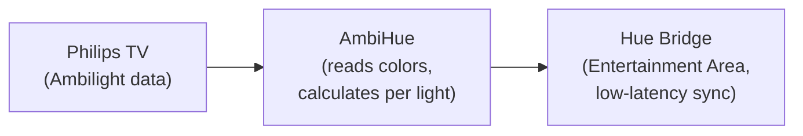

# AmbiHue

[](https://github.com/maarnix/ambihue/actions/workflows/superlinter.yml)
[](https://github.com/maarnix/ambihue/actions/workflows/docker_build.yml)

AmbiHue restores the connection between Philips Ambilight TVs and the Hue Bridge by reading Ambilight color data from the TV and forwarding it to Hue lights via the Entertainment Area API.

The Hue Entertainment Area provides low-latency color updates with smooth transitions.




---

## Home Assistant Add-on (Recommended)

### Installation

1. [](https://my.home-assistant.io/redirect/supervisor_add_addon_repository/?repository_url=https%3A%2F%2Fgithub.com%2Fmaarnix%2Fambihue)

2. Go to **Settings → Add-ons → Add-on Store** and install **AmbiHue**

### Quick Start

1. Create an **Entertainment Area** in the Philips Hue app ([tutorial](https://www.youtube.com/watch?v=OlXapdkedus))
2. **Press the button** on your Hue Bridge
3. **Start** the add-on — it auto-discovers your TV and Bridge
4. Check the **Log** tab for discovered lights, then configure positions in the **Configuration** tab

### Auto-Discovery

AmbiHue automatically discovers and configures devices when credentials are not yet set:

| Device | Discovery Method |
|--------|-----------------|
| **Hue Bridge** | Philips cloud portal + direct HTTPS API (works in Docker). Press the Bridge button before or during startup. |
| **Philips TV** | Home Assistant device registry (if `philips_js` integration exists), then SSDP network scan as fallback. |

### TV Pairing

| TV Type | Pairing |
|---------|---------|
| **Non-Android TV** | No authentication required. Connects automatically after discovery. |
| **Android TV** | PIN-based two-phase pairing (see below). |

#### Android TV PIN Pairing

Android TVs require PIN authentication, handled in two phases:

1. **Start the add-on** — a PIN code appears on your TV screen. The add-on saves a pairing key internally and exits.
2. Go to **Settings → Add-ons → AmbiHue → Configuration** and enter the PIN in the `pairing_pin` field. Save.
3. **Restart the add-on** — it pairs using the saved key and your PIN. Credentials are stored automatically.

> The `pairing_pin` field is only used during initial setup. After successful pairing, it can be left empty.

### Configure Light Positions

After setup, check the **Log** tab for discovered lights:

```
============================================================
ENTERTAINMENT ZONES DISCOVERED
============================================================
Zone 0: Living Room
  Lights:
    [0] Hue Play Bar 1
    [1] Hue Play Bar 2
============================================================
```

Then configure `lights_setup` in the **Configuration** tab:

```yaml
lights_setup:
  - name: "wall_left"
    id: 0              # Light index from discovered list
    positions: "0,1,2" # TV ambilight zones (comma-separated)
  - name: "wall_right"
    id: 1
    positions: "12,13,14"
```

**Ambilight Zone Map** (positions 0–16):

```text
       [4]0T  [5]1T  [6]2T  [7]3T  [8]4T  [9]5T  [10]6T  [11]7T  [12]8T
[3]3L                                                                [13]0R
[2]2L                                                                [14]1R
[1]1L                                                                [15]2R
[0]0L                                                                [16]3R
```

Use [this video](https://youtu.be/8u4UzzJZAUg?t=66) to test color mapping.

### Automation with TV State

AmbiHue can start/stop automatically based on your TV's power state using Home Assistant automations. See [DOCS.md](DOCS.md#automation-with-home-assistant-tv-state) for setup instructions.

### Tuning

| Option | Default | Description |
|--------|---------|-------------|
| `refresh_rate_ms` | `0` | Delay between updates (0 = fastest) |
| `transition_smoothing` | `0.5` | Color smoothing (0.0 = instant, 0.95 = very smooth) |
| `idle_refresh_rate_ms` | `5000` | Poll rate when TV screen is black |
| `black_screen_timeout_s` | `30` | Seconds of black before stopping Hue session |

See [DOCS.md](DOCS.md#advanced-options) for all options.

### Persistent Configuration

AmbiHue saves discovered credentials to a separate state file (`/data/ambihue_state.json`) that persists across add-on restarts. Home Assistant overwrites the add-on's `options.json` on each restart, so AmbiHue merges saved state back into the config automatically.

---

## Standalone / Local Development

For running outside Home Assistant:

### Setup

```bash
cp userconfig.example.yaml userconfig.yaml
pip3 install -r requirements.txt
pip3 install .
```

Edit `userconfig.yaml` with your device details, or leave placeholder values for auto-discovery.

### Hue Bridge

1. Create an Entertainment Area in the Philips Hue app
2. Run discovery (press Bridge button when prompted):
   ```bash
   ./ambihue.py --discover_hue --loglevel DEBUG
   ```
3. Copy the printed values to `userconfig.yaml` under `hue_entertainment_group`
4. Verify: `./ambihue.py --verify hue --loglevel DEBUG`

### Philips TV

1. Set the TV IP in `userconfig.yaml` under `ambilight_tv`, or leave as placeholder for SSDP discovery
2. For Android TVs: run AmbiHue and enter the PIN when prompted in the terminal
3. Verify: `./ambihue.py --verify tv --loglevel DEBUG`

### Light Positions

Configure lights in `userconfig.yaml`:

```yaml
lights_setup:
  wall_left:
    id: 0
    positions: [0, 1, 3]
  wall_right:
    id: 1
    positions: [10, 12, 13]
```

Run: `./ambihue.py --loglevel DEBUG`

---

## CLI Reference

| Flag | Description |
|------|-------------|
| `--verify hue` | Test Hue Bridge connection (first light turns red) |
| `--verify tv` | Test TV API connection |
| `--discover_hue` | Discover Hue Bridge and print credentials |
| `--loglevel LEVEL` | Set log level: `DEBUG`, `INFO`, `WARNING`, `ERROR`, `CRITICAL` |

---

## Project Structure

| Path | Description |
|------|-------------|
| `ambihue.py` | Entry point, auto-setup flow, config management |
| `src/main.py` | Main loop: reads TV colors, sends to Hue |
| `src/ambilight_tv.py` | Philips TV Ambilight API client |
| `src/hue_entertainment.py` | Hue Entertainment Area streaming + bridge pairing |
| `src/tv_discovery.py` | TV SSDP discovery, HA registry lookup, PIN pairing |
| `src/config_loader.py` | YAML config loader with validation |
| `src/color_mixer.py` | Color averaging for ambilight zones |
| `src/colors.py` | Color utility functions |
| `config.yaml` | Home Assistant add-on definition |
| `userconfig.example.yaml` | Template for standalone config |
| `Dockerfile` | Docker image for HA add-on |
| `requirements.txt` | Python dependencies |

---

## Development

### Local add-on testing

1. Copy code to the HA add-ons directory:
   ```bash
   rsync -r ../ambihue root@<HA_IP>:/addons --stats
   ```
2. Follow the [official local add-on guide](https://developers.home-assistant.io/docs/add-ons/tutorial#step-2-installing-and-testing-your-add-on)
3. Bump `version` in `config.yaml` after each change for HA to detect updates

### Cross-platform Docker builds

```bash
docker run --rm --privileged multiarch/qemu-user-static --reset -p yes
docker build --progress=plain --platform linux/arm64/v8 -t ambihue_test_arm8 .
docker build --progress=plain --platform linux/arm/v7 -t ambihue_test_arm7 .
```

### Code validation

```bash
./.github/verify_code.py
```
